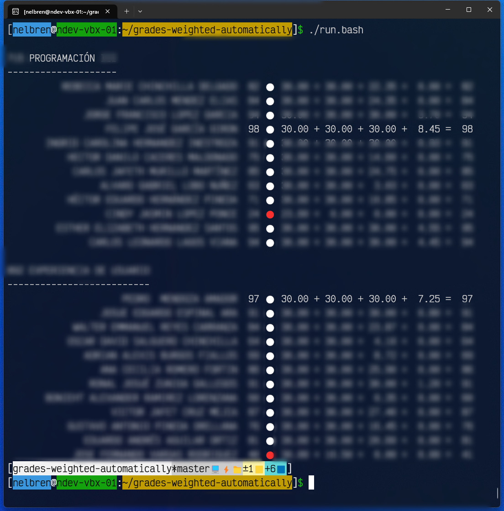

# Grades weighted automatically using API of Canvas Instructure

- ## More information on how this program was developed

  - ###  [Automatically weighted grades and ChatGPT](https://nelbren.com/en/blackboard/canvas/chatgpt/grades-weighted-automatically_and_ChatGPT/)
  - ###  [Calificaciones ponderadas automáticamente y ChatGPT](https://nelbren.com/es/blackboard/canvas/chatgpt/grades-weighted-automatically_and_ChatGPT/)

- ## Output example
  

1. ## Get your API_KEY like this:
   - `Canvas`->`Account`->`Settings`->`New Access Token`->`Fill fields of Purpose and Expires`->`Generate token`->`Copy the token!`
   - Or view this video for more details: https://www.youtube.com/watch?v=cZ5cn8stjM0

2. ## Install this project

    - ### 🐧Linux, 🍎Mac or 🪟 Windows
      `git clone https://github.com/nelbren/grades-weighted-automatically.git`

3. ## Install requirements

   - ### Install **Python 3**:
     - #### 🐧Linux
       `sudo apt install python3-pip`
     - #### 🍎Mac
        [Python Releases for macOS](https://www.python.org/downloads/macos/)
     - #### 🪟 Windows
        **Microsoft Store** -> **`Python 3.12`**

    - ### Install the necessary files:
      - #### 🐧Linux or 🍎Mac
        `./install.bash`
      - #### 🪟 Windows
        `install.bat`

4. ## Set your Instructure URL and API_KEY like this:

   - ### Using the environment variables:
     - #### Rename the **my_set_env** file:
       - ##### 🐧Linux or 🍎 Mac
          Rename or copy **my_set_env.bash.example** to **my_set_env.bash**
       - ##### 🪟 Windows
          Rename or copy **my_set_env.bat.example** to **my_set_env.bat**
       - ##### Setting environment variables in the file.
          - **INSTRUCTURE_URL**='https://some.instructure.com'
          - **API_KEY**='your-api-key'
       - ##### Run:
         - ###### 🐧Linux or 🍎Mac
           **`./run.bash`**
         - ###### 🪟 Windows
           **`run.bat`**
   - ### Or using parameters:
     - #### Setting in the command line:
       - ##### **`-u URL`**, **`--instructure_url https://some.instructure.com`**
       - ##### **`-k API_KEY`**, **`--api_key API_KEY`**
     - #### Run:
       - ##### 🐧Linux, 🍎Mac or 🪟Windows
         `python3 grades-weighted-automatically.py -u replace-with-your-INFRASTRUCTURE-URL -k replace-with-your-KEY_API`
